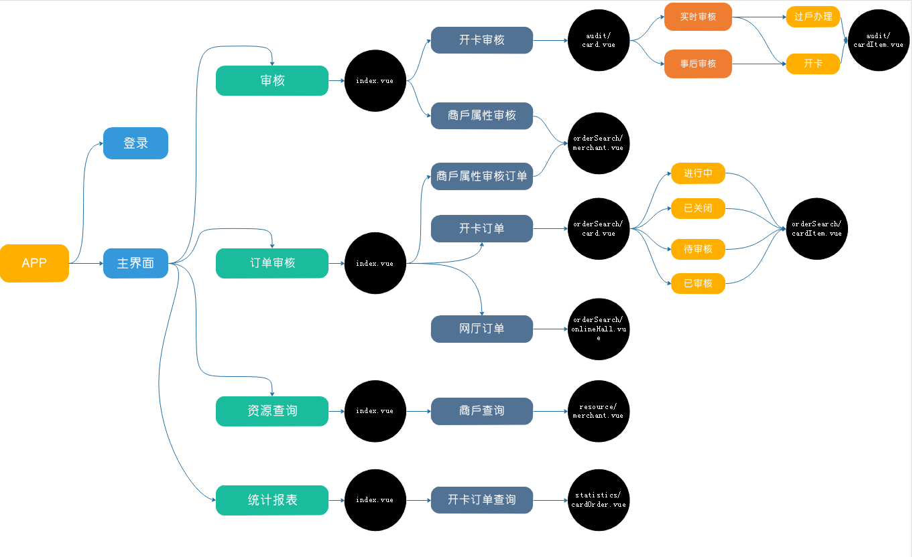

# ecs

> 路由导图

## Build Setup

``` bash
# install dependencies
npm install

# serve with hot reload at localhost:8080
npm run dev

# build for production with minification
npm run build

# build for production and view the bundle analyzer report
npm run build --report
```

For detailed explanation on how things work, checkout the [guide](http://vuejs-templates.github.io/webpack/) and [docs for vue-cli](https://github.com/vuejs/vue-cli).
# ka_ecs
├── README.md

├── build
│   ├── build.js
│   ├── check-versions.js
│   ├── dev-client.js
│   ├── dev-server.js
│   ├── utils.js
│   ├── webpack.base.conf.js
│   ├── webpack.dev.conf.js
│   └── webpack.prod.conf.js
